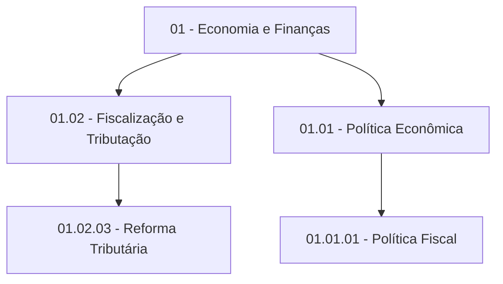

## Visão Geral {.unnumbered}

::: {.callout-tip icon=true}
## Ideal para APIs e Microserviços

`NewsClassifier` é uma versão simplificada e standalone do sistema de enriquecimento, perfeita para:

- **APIs REST** (FastAPI, Flask, Django)
- **Microserviços**
- **Integrações com sistemas externos**
- **Processamento em tempo real**
:::

### Diferenças do Sistema Completo

::: {.grid}
::: {.g-col-6}
**Vantagens**

- Não acessa base de dados
- Recebe notícias via parâmetro
- Retorna apenas JSON
- Mais leve e portável
:::

::: {.g-col-6}
**Não inclui**

- `NewsDatasetManager`
- `NewsEnricher`
- `PostgresExporter`
- Dataset Hugging Face
:::
:::

---

## Instalação {#sec-instalacao}

### Dependências

```bash
pip install boto3 pyyaml
```

### Importação

```python
from news_enrichment import NewsClassifier
```

---

## Uso Básico {#sec-uso-basico}

### 1. Inicialização

::: {.panel-tabset}

## Com Taxonomia (Recomendado)

```python
from news_enrichment import NewsClassifier
import yaml

# Carregar taxonomia
with open("arvore.yaml", "r", encoding="utf-8") as f:
    taxonomy_raw = yaml.safe_load(f)
    taxonomy = parse_taxonomy(taxonomy_raw)

# Inicializar classificador
classifier = NewsClassifier(
    model_id="anthropic.claude-3-haiku-20240307-v1:0",
    region="us-east-1",
    taxonomy=taxonomy,
    batch_size=4,
    sleep_between_batches=0.5,
    verbose=False
)
```

## Sem Taxonomia (Orgânico)

```python
classifier = NewsClassifier(
    model_id="anthropic.claude-3-haiku-20240307-v1:0",
    region="us-east-1",
    taxonomy=None  # LLM cria categorias organicamente
)
```

:::

### 2. Classificar Uma Notícia

```python
noticia = {
    'title': 'Governo anuncia reforma tributária',
    'content': 'O governo federal lançou proposta...'
}

# Retorna dict
resultado = classifier.classify_single(noticia, return_format="dict")

# Ou retorna JSON string
resultado_json = classifier.classify_single(noticia, return_format="json")
```

::: {.callout-note collapse="true"}
## Exemplo de Saída

```json
{
  "theme_1_level_1": "Economia e Finanças",
  "theme_1_level_1_code": "01",
  "theme_1_level_1_label": "Economia e Finanças",
  "theme_1_level_2_code": "01.02",
  "theme_1_level_2_label": "Fiscalização e Tributação",
  "theme_1_level_3_code": "01.02.03",
  "theme_1_level_3_label": "Reforma Tributária",
  "most_specific_theme_code": "01.02.03",
  "most_specific_theme_label": "Reforma Tributária",
  "summary": "Governo federal anuncia proposta de reforma tributária..."
}
```
:::

### 3. Classificar Múltiplas Notícias

```python
noticias = [
    {
        'title': 'Notícia 1',
        'content': 'Conteúdo 1...'
    },
    {
        'title': 'Notícia 2',
        'content': 'Conteúdo 2...'
    }
]

# Retorna lista de dicts
resultados = classifier.classify_batch(noticias, return_format="list")

# Ou retorna JSON string
resultados_json = classifier.classify_batch(noticias, return_format="json")
```

---

## Schema de Dados {#sec-schema}

### Campos de Entrada

::: {.callout-important}
## Campos Obrigatórios
- `title` (string) - Título da notícia
- `content` (string) - Conteúdo da notícia
:::

**Opcionais:**

- `subtitle` (string) - Subtítulo
- `editorial_lead` (string) - Lead editorial
- `unique_id` (string) - ID único (mantido na saída)

### Campos de Saída

| Campo | Tipo | Descrição |
|-------|------|-----------|
| `theme_1_level_1` | string | Tema nível 1 |
| `theme_1_level_1_code` | string | Código nível 1 (ex: "01") |
| `theme_1_level_1_label` | string | Label nível 1 |
| `theme_1_level_2_code` | string | Código nível 2 (ex: "01.02") |
| `theme_1_level_2_label` | string | Label nível 2 |
| `theme_1_level_3_code` | string | Código nível 3 (ex: "01.02.03") |
| `theme_1_level_3_label` | string | Label nível 3 |
| `most_specific_theme_code` | string | Código mais específico |
| `most_specific_theme_label` | string | Label mais específico |
| `summary` | string | Resumo (2-3 frases) |
| `unique_id` | string | ID único (se fornecido) |

: Estrutura de Saída {#tbl-output}

---

## Uso com APIs {#sec-apis}

::: {.panel-tabset}

## FastAPI

```python
#| code-line-numbers: true
from fastapi import FastAPI, HTTPException
from pydantic import BaseModel
from news_enrichment import NewsClassifier
import yaml

# Setup
app = FastAPI(
    title="News Classification API",
    description="Classificação automática de notícias com LLM",
    version="1.0.0"
)

# Carregar taxonomia (no startup)
@app.on_event("startup")
async def startup_event():
    global classifier

    with open("arvore.yaml", "r", encoding="utf-8") as f:
        taxonomy_raw = yaml.safe_load(f)
        taxonomy = parse_taxonomy(taxonomy_raw)

    classifier = NewsClassifier(
        model_id="anthropic.claude-3-haiku-20240307-v1:0",
        region="us-east-1",
        taxonomy=taxonomy,
        verbose=False
    )

# Modelos Pydantic
class NewsRequest(BaseModel):
    title: str
    content: str
    subtitle: str | None = None
    editorial_lead: str | None = None
    unique_id: str | None = None

class NewsResponse(BaseModel):
    status: str
    message: str
    data: dict | None

# Endpoints
@app.post("/classify", response_model=NewsResponse)
def classify_news(news: NewsRequest):
    """Classifica uma única notícia."""
    try:
        result = classifier.classify_single(
            news.dict(exclude_none=True),
            return_format="dict"
        )
        return {
            "status": "success",
            "message": "Notícia classificada com sucesso",
            "data": result
        }
    except Exception as e:
        raise HTTPException(status_code=500, detail=str(e))

@app.post("/classify/batch", response_model=NewsResponse)
def classify_batch(news_list: list[NewsRequest]):
    """Classifica múltiplas notícias."""
    try:
        results = classifier.classify_batch(
            [n.dict(exclude_none=True) for n in news_list],
            return_format="list"
        )
        return {
            "status": "success",
            "message": f"{len(results)} notícias classificadas",
            "data": results
        }
    except Exception as e:
        raise HTTPException(status_code=500, detail=str(e))

@app.get("/health")
def health():
    """Health check endpoint."""
    return {"status": "ok", "service": "news-classifier"}

@app.get("/taxonomy/summary")
def taxonomy_summary():
    """Retorna resumo da taxonomia."""
    return classifier.get_taxonomy_summary()
```

## Flask

```python
from flask import Flask, request, jsonify
from news_enrichment import NewsClassifier
import yaml

app = Flask(__name__)

# Setup (no startup)
with open("arvore.yaml", "r", encoding="utf-8") as f:
    taxonomy_raw = yaml.safe_load(f)
    taxonomy = parse_taxonomy(taxonomy_raw)

classifier = NewsClassifier(
    model_id="anthropic.claude-3-haiku-20240307-v1:0",
    region="us-east-1",
    taxonomy=taxonomy,
    verbose=False
)

@app.route("/classify", methods=["POST"])
def classify_news():
    """Classifica uma única notícia."""
    try:
        news_data = request.json
        result = classifier.classify_single(news_data, return_format="dict")
        return jsonify({
            "status": "success",
            "message": "Notícia classificada com sucesso",
            "data": result
        })
    except Exception as e:
        return jsonify({
            "status": "error",
            "message": str(e),
            "data": None
        }), 500

@app.route("/classify/batch", methods=["POST"])
def classify_batch():
    """Classifica múltiplas notícias."""
    try:
        news_list = request.json
        results = classifier.classify_batch(news_list, return_format="list")
        return jsonify({
            "status": "success",
            "message": f"{len(results)} notícias classificadas",
            "data": results
        })
    except Exception as e:
        return jsonify({
            "status": "error",
            "message": str(e),
            "data": None
        }), 500

@app.route("/health")
def health():
    """Health check endpoint."""
    return jsonify({"status": "ok"})

if __name__ == "__main__":
    app.run(debug=False, host="0.0.0.0", port=5000)
```

:::

::: {.callout-tip}
## Testando a API

```bash
# Iniciar servidor FastAPI
uvicorn main:app --reload

# Testar endpoint
curl -X POST "http://localhost:8000/classify" \
  -H "Content-Type: application/json" \
  -d '{
    "title": "Governo anuncia reforma tributária",
    "content": "O governo federal..."
  }'
```
:::

---

## Configuração AWS {#sec-aws}

O `NewsClassifier` suporta múltiplas formas de autenticação AWS:

::: {.panel-tabset}

## Desenvolvimento Local

```bash
# Usar ~/.aws/credentials
aws configure
```

```python
classifier = NewsClassifier(
    model_id="anthropic.claude-3-haiku-20240307-v1:0",
    region="us-east-1"
)
# Usa credenciais de ~/.aws/credentials automaticamente
```

## Produção (Env Vars)

```bash
export AWS_ACCESS_KEY_ID="sua-key"
export AWS_SECRET_ACCESS_KEY="sua-secret"
export AWS_DEFAULT_REGION="us-east-1"
```

```python
classifier = NewsClassifier(
    model_id="anthropic.claude-3-haiku-20240307-v1:0",
    region="us-east-1"
)
# Usa variáveis de ambiente automaticamente
```

## Deploy AWS (IAM Role)

```python
# Credenciais automáticas via IAM role (MAIS SEGURO)
classifier = NewsClassifier(
    model_id="anthropic.claude-3-haiku-20240307-v1:0",
    region="us-east-1"
)
# boto3 detecta IAM role automaticamente
```

## Credenciais Explícitas

```python
import os

classifier = NewsClassifier(
    model_id="anthropic.claude-3-haiku-20240307-v1:0",
    region="us-east-1",
    aws_access_key_id=os.getenv("AWS_ACCESS_KEY_ID"),
    aws_secret_access_key=os.getenv("AWS_SECRET_ACCESS_KEY")
)
```

:::

---

## Taxonomia {#sec-taxonomia}

### Estrutura Hierárquica

A taxonomia segue uma estrutura de 3 níveis:



### Carregar Taxonomia

```python
import yaml

def parse_taxonomy(taxonomy_raw):
    """Converte taxonomia YAML para formato estruturado."""
    taxonomy = {}

    for key, value in taxonomy_raw.items():
        code = key.split(" - ")[0].strip()
        label = key.split(" - ")[1].strip()

        taxonomy[code] = {
            "label": label,
            "subcategories": {}
        }

        if isinstance(value, dict):
            for subkey, subvalue in value.items():
                subcode = subkey.split(" - ")[0].strip()
                sublabel = subkey.split(" - ")[1].strip()

                taxonomy[code]["subcategories"][subcode] = {
                    "label": sublabel,
                    "subcategories": {}
                }

                if isinstance(subvalue, list):
                    for item in subvalue:
                        if isinstance(item, str) and " - " in item:
                            itemcode = item.split(" - ")[0].strip()
                            itemlabel = item.split(" - ")[1].strip()

                            taxonomy[code]["subcategories"][subcode]["subcategories"][itemcode] = {
                                "label": itemlabel
                            }

    return taxonomy

# Usar
with open("arvore.yaml", "r", encoding="utf-8") as f:
    taxonomy_raw = yaml.safe_load(f)
    taxonomy = parse_taxonomy(taxonomy_raw)
```

### Resumo da Taxonomia

```python
summary = classifier.get_taxonomy_summary()
print(summary)
```

::: {.callout-note collapse="true"}
## Exemplo de Saída

```json
{
  "mode": "predefined",
  "level_1_categories": 25,
  "level_2_categories": 98,
  "level_3_categories": 287,
  "total_categories": 410
}
```
:::

---

## Abordagem de Classificação {#sec-abordagem}

::: {.callout-important icon=true}
## Classificação Hierárquica em Uma Única Chamada

O `NewsClassifier` classifica os **3 níveis da taxonomia simultaneamente** em uma única chamada à API. Esta abordagem é significativamente mais eficiente que classificação sequencial.
:::

### Por Que Uma Única Chamada?

**Vantagens técnicas:**

1. **Contexto acumulado melhora assertividade**
   - Cada nível usa os anteriores como contexto
   - Nível 1 ("Economia") guia seleção do Nível 2 ("Tributação")
   - Nível 2 refina seleção do Nível 3 ("Reforma Tributária")
   - **Hierarquia coerente garantida**

2. **Mecanismo de atenção otimiza processamento**
   - Taxonomia completa (~1500 tokens) = 0.75% do context window
   - Modelo processa todos os níveis em paralelo via atenção
   - Similar à ativação associativa da memória humana
   - "Reforma" na notícia → ativa automaticamente toda a hierarquia relevante

3. **Performance superior**
   - 1 chamada vs 3 chamadas sequenciais
   - 3x mais rápido (4.3s vs ~13s)
   - 3x mais barato
   - Zero risco de erro em cascata

### Comparação: Single-Shot vs Sequencial

::: {.grid}
::: {.g-col-6}
**Single-Shot (Atual)**

```
Input: Taxonomia completa + Notícia
        ↓
  [Claude Haiku]
        ↓
Output: 3 níveis + resumo
```

- Tempo: **4.3s**
- Custo: **1x**
- Acurácia: **Alta**
- Hierarquia: **Coerente**
:::

::: {.g-col-6}
**Sequencial (Alternativa)**

```
Call 1: Nível 1 → "01"
Call 2: Nível 2 → "01.02"
Call 3: Nível 3 → "01.02.03"
```

- Tempo: **~13s**
- Custo: **3x**
- Acurácia: **Média**
- Risco: **Erro cascata**
:::
:::

### Tamanho da Taxonomia

::: {.callout-note}
## Não Há Sobrecarga

- Taxonomia: **~1500 tokens** (410 categorias totais)
- Context window: **200.000 tokens** (Claude Haiku)
- Proporção: **0.75%** do contexto
- Notícia típica: **~2000 tokens**
- **Total usado: 1.75%** do contexto disponível

Há espaço de sobra - nenhum problema de memória ou performance.
:::

### Atenção Hierárquica Automática

O Claude naturalmente captura relações pai-filho:

```
Notícia: "Governo anuncia reforma tributária..."
           ↓
    [Mecanismo de Atenção]
           ↓
01 - Economia e Finanças          ← Atenção: 5%
  01.02 - Tributação              ← Atenção: 10%
    01.02.03 - Reforma Tributária ← Atenção: 85%
```

**Todos os níveis são considerados simultaneamente**, sem necessidade de navegação sequencial.

---

## Performance {#sec-performance}

### Configuração Recomendada

::: {.callout-tip icon=true}
## Setup Otimizado

```python
classifier = NewsClassifier(
    model_id="anthropic.claude-3-haiku-20240307-v1:0",  # Haiku (rápido + barato)
    region="us-east-1",
    taxonomy=taxonomy,
    batch_size=4,              # Otimizado empiricamente
    sleep_between_batches=0.5  # Evita throttling
)
```
:::

### Métricas

::: {.grid}
::: {.g-col-4}
**Velocidade**

- Tempo médio: **2.9s/notícia**
- Batch de 4: **~11.6s total**
:::

::: {.g-col-4}
**Custo**

- Por notícia: **$0.001**
- 1000 notícias: **~$1.00**
:::

::: {.g-col-4}
**Confiabilidade**

- Taxa de sucesso: **100%**
- Zero throttling
:::
:::

### Comparação de Modelos

| Métrica | Claude Haiku | Claude Sonnet 3.5 |
|---------|--------------|-------------------|
| Tempo/notícia | **2.9s**  | 11.3s |
| Custo/notícia | **$0.001** | $0.007 |
| Taxa sucesso | **100%** | 80% |
| Qualidade | Alta | Equivalente |

: Comparação de Performance {#tbl-benchmark}

::: {.callout-warning}
## Recomendação

**Use Claude Haiku** em produção: 4x mais rápido, 7x mais barato, mesma qualidade.
:::

---

## Arquitetura {#sec-arquitetura}

### Comparação: Sistema Completo vs Classifier

| Aspecto | NewsEnricher (completo) | NewsClassifier (standalone) |
|---------|-------------------------|----------------------------|
| **Input** | Dataset Hugging Face | Parâmetros (dict/list) |
| **Output** | Parquet/CSV/Postgres | JSON/Dict |
| **Uso** | Processamento batch | API/microserviço |
| **Dataset** | Requer | Não requer |
| **Complexidade** | Alta | Baixa |
| **Portabilidade** | Média | **Alta** |

: Comparação Arquitetural {#tbl-comparison}

### Estrutura de Arquivos Mínima

```bash
projeto/
├── news_enrichment/
│   ├── __init__.py
│   ├── llm_client.py      # Cliente Bedrock
│   └── classifier.py      # NewsClassifier
├── arvore.yaml            # Taxonomia (opcional)
└── seu_app.py             # Sua API/aplicação
```

::: {.callout-note}
## Não Necessário

- `dataset_manager.py`
- `enricher.py`
- `postgres_exporter.py`
- Dataset Hugging Face
:::

---

## Exemplos Práticos {#sec-exemplos}

### Exemplo 1: Script Standalone

```python
#| eval: false
# Ver: exemplo_classificacao.py

from news_enrichment import NewsClassifier

classifier = NewsClassifier(
    model_id="anthropic.claude-3-haiku-20240307-v1:0",
    region="us-east-1",
    taxonomy=taxonomy
)

# Classificar
noticia = {
    'title': 'Governo federal assina acordo fundiário em Teresópolis',
    'content': 'Mais de 10 mil famílias serão beneficiadas...'
}

resultado = classifier.classify_single(noticia, return_format="dict")

print(f"Tema: {resultado['most_specific_theme_label']}")
print(f"Resumo: {resultado['summary']}")
```

### Exemplo 2: Integração com API

```python
#| eval: false
# Ver: exemplo_api_classificacao.py

def classify_news_endpoint(classifier, news_data):
    """Endpoint para classificar notícia."""
    try:
        result = classifier.classify_single(news_data, return_format="dict")
        return {
            'status': 'success',
            'data': result
        }
    except Exception as e:
        return {
            'status': 'error',
            'message': str(e)
        }
```

---

## Próximos Passos {#sec-next-steps}

::: {.callout-tip icon=true}
## Melhorias Sugeridas

1. **Rate Limiting** - Limitar requests por IP/token
2. **Autenticação** - Adicionar API keys (se usada em API)
3. **Monitoramento** - Integrar com Prometheus/Grafana
4. **Async** - Versão async para FastAPI (`asyncio`)
:::

---

## Recursos Adicionais {#sec-recursos}

- [Documentação Completa](DOCUMENTACAO_PROMPTS.md)
- [Benchmarks](benchmark_prompts.py)
- [Sistema Completo](exemplo_enriquecimento.py)
- [GitHub](https://github.com/seu-repo)

---

::: {.callout-note icon=true}
## Status do Projeto

**Pronto para Produção**

- Testado com 10-500 notícias
- Taxa de sucesso: 100% - resiliente a Throttling
- Performance otimizada
- Documentação completa
:::

---

<center>
*Última atualização: `r Sys.Date()`*
</center>
